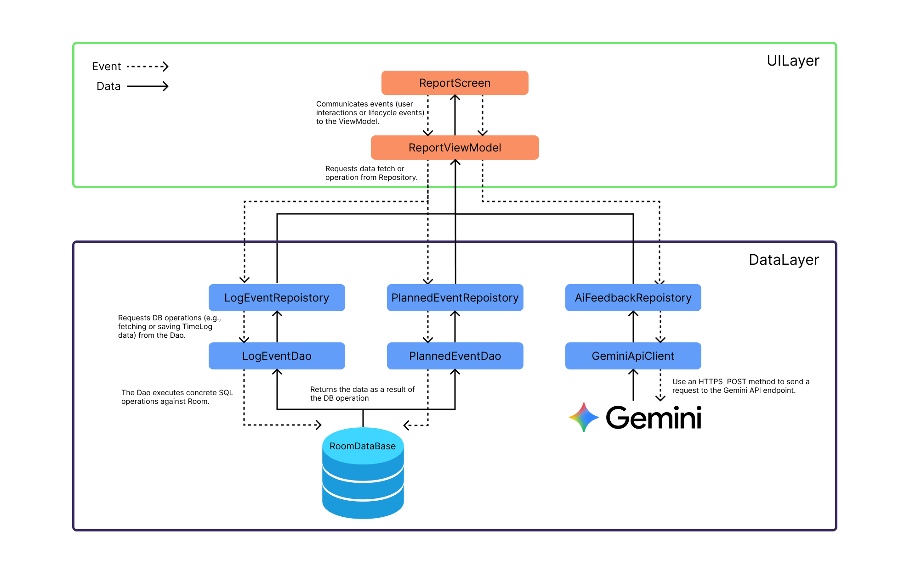

# Architecture

## Overview

This document describes the architecture of the "TimeInventory" application, including its layer
composition, key classes, and their interactions.

## Design Goals

The goals of the app architecture are as follows:

- Adhere to the [official architecture guidance](https://developer.android.com/jetpack/guide) as
  much as possible
- Improve development velocity by making the architecture easy to understand
- Make changes easier
- Make testing easier
- Reduce build times

## Architecture Overview

The app architecture consists of two
layers: [Data Layer](https://developer.android.com/jetpack/guide/data-layer)
and [UI Layer](https://developer.android.com/jetpack/guide/ui-layer).

> **Note**
> The Domain layer is omitted in this app. The official Android architecture considers the Domain
> layer as optional, and we judged it unnecessary at this point since the app does not have complex
> business logic. For more details, please refer
> to [this documentation](https://developer.android.com/topic/architecture?hl=en#domain-layer).

The architecture follows a reactive programming model
with [unidirectional data flow](https://developer.android.com/jetpack/guide/ui-layer#udf). With the
Data Layer as the foundation, the key concepts are:

- Higher layers react to changes in lower layers
- Events flow downward
- Data flows upward

Data flow is implemented using streams
with [Kotlin Flows](https://developer.android.com/kotlin/flow).

### Architecture Diagram

## Data Flow Example: AI Feedback Generation on the Report Screen

This example illustrates the data flow when a user requests AI-generated feedback on the Report
Screen.

### Event Flow (Downward - User Actions)

1. The user taps the **"Generate Feedback" button** on the `ReportScreen`.
2. The `ReportScreen` communicates this user interaction event to the `ReportViewModel` by calling
   `getFormattedLogEvents()` and `getFormattedPlannedEvents()` suspend functions within a coroutine
   scope.
3. The `ReportViewModel` requests data fetch operations from the `LogEventRepository` and
   `PlannedEventRepository` in the Data Layer.
4. Each repository requests DB operations from its corresponding DAO (`LogEventDao`,
   `PlannedEventDao`).
5. The DAOs execute concrete SQL operations against the **Room database**.

### Data Flow (Upward - Data Response)

6. The Room database returns the data as a result of the DB operation to each DAO.
7. The DAOs return the data to their respective repositories.
8. The repositories format the data and return it to the `ReportViewModel`.
9. The `ReportViewModel` constructs the final prompt string and communicates an event to the
   `AiFeedbackRepository` by calling `generateFeedback(targetDate, prompt)`.
10. The `AiFeedbackRepository` requests the `GeminiApiClient` (from `core:network`) to send an HTTPS
    POST request to the **Gemini API** endpoint.
11. The Gemini API processes the request and returns a JSON response containing the generated
    feedback.
12. The `GeminiApiClient` returns the raw JSON response to the `AiFeedbackRepository`.
13. The `AiFeedbackRepository` parses the JSON into a DTO, maps it to a domain model (`AiFeedback`),
    and saves it to the local Room database via `AiFeedbackDao`.
14. The `AiFeedbackRepository` returns the `AiFeedback` object to the `ReportViewModel`.
15. The `ReportViewModel` updates its `uiState` to `AiFeedbackState.Success(feedback)`.
16. The `ReportScreen`, which is collecting the `uiState` flow, automatically recomposes to display
    the generated feedback to the user.

## Data Layer

The Data Layer contains app data and business logic. It is the single source of truth for all data
in the app.

The Data Layer is composed of Repositories, each potentially depending on one or more data sources
. Repositories are the public API to other layers and provide the only way to access app data.

Repositories are the public API to other layers and provide the only way to access app data.
Repositories typically provide one or more methods for reading and writing data.

### Reading Data

Reading of the application's primary data (such as LogEvent and PlannedEvent) is exposed as data
streams. This means that each client of the Repository must be prepared to respond to data changes.

Reading is performed from local storage (such as a database) as the single source of truth (SSOT).
Therefore, data integrity errors themselves are minimized. However, technical errors such as IO
errors may still occur.

Reading is performed from the local database as the single source of truth (SSOT). This minimizes
data integrity errors, although technical errors like I/O exceptions can still occur.

**Example: Reading a List of LogEvents**

A list of LogEvents can be obtained by subscribing to the `LogEventRepository` flow methods such as
`getLogEventsByDateStream(date)` or `getLogEventsByPeriodStream(startDate, endDate)`, which emit
`Flow<List<LogEvent>>`.

Whenever the list of LogEvents changes (for example, when a new record is added), an updated
`List<LogEvent>` is emitted to the stream.

### Writing Data

To write data, Repositories provide suspend functions. The caller is responsible for ensuring they
are executed in the appropriate scope.

**Example: Creating a new PlannedEvent**

When the user saves a new event from the `EventBottomSheetContent`, the `TimelineViewModel` calls a
repository method (e.g., `plannedEventRepository.upsertPlannedEvent(...)`). This `suspend` function
inserts or updates a record in the local database via its DAO.

### Data Sources

Repositories may depend on one or more data sources. The main data sources in this app are:

| Name                      | Module          | Implementation Technology | Purpose                                                                              |
|---------------------------|-----------------|---------------------------|--------------------------------------------------------------------------------------|
| DAO (e.g., `LogEventDao`) | `core:database` | **Room**                  | Persistent relational data related to `LogEvent`, `PlannedEvent`, `AiFeedback`, etc. |
| Gemini API Client         | `core:network`  | **Ktor**                  | External source for generating AI-based feedback via REST API                        |

### Data Synchronization

Repositories are responsible for coordinating data between local storage and remote sources. When
data is fetched from a remote data source, it is immediately written to local storage. Updated data
is sent from local storage to the associated data stream and received by all listening clients.

This approach separates the app's reading and writing concerns so they don't interfere with each
other.

## UI Layer

The [UI Layer](https://developer.android.com/topic/architecture/ui-layer) consists of:

- UI elements built
  using [Compose Multiplatform](https://www.jetbrains.com/lp/compose-multiplatform/)
- [ViewModels](https://developer.android.com/topic/libraries/architecture/viewmodel) (KMP
  compatible)

ViewModels receive streams of data from Repositories and transform them into UI state. UI elements
reflect this state and provide ways for users to interact with the app. These interactions are
passed to ViewModels as events and processed.

### Modeling UI State

UI state is modeled as a hierarchy using`sealed interface` and its implementations as immutable
`data class` or `data object`. State objects are only emitted through the transformation of data
streams from the Data Layer or in response to user events
. This approach ensures:

- UI state represents the underlying app data (SSOT data provided by Repositories) formatted for
  UI display.
- UI elements exhaustively handle all possible states (e.g., `Initial`, `Loading`, `Success`,
  `Error`) defined in the sealed hierarchy using a `when` expression.

**Example: UI State Modeling**

The UI state for each screen is modeled using this hierarchical approach.

- For the `TimelineScreen`, `TimelineUiState` is reactively constructed by combining multiple `Flow`
  streams from the data layer. Any change in the underlying data automatically triggers a `uiState`
  update.
- For the `ReportScreen`, `ReportUiState` is updated more imperatively. The `ReportViewModel`
  manually sets the state to `Loading`, `Success`, or `Error` in response to user-triggered events,
  such as a button click.

### Transforming Streams to UI State

ViewModels expose UI state as a `StateFlow`. This state can be constructed in two primary ways:

1. **Reactively**: For screens that need to observe data changes continuously (e.g.,
   `TimelineScreen`), ViewModels receive data streams (`Flow`) from Repositories. These are combined
   using operators like `combine` or `flatMapLatest` to produce a single `Flow` of UI state, which
   is then converted to a `StateFlow` using `stateIn`. This ensures the UI always reflects the
   latest data from the source of truth.

2. **Imperatively**: For screens driven by single-shot user actions (e.g., `ReportScreen`), the
   ViewModel holds a `MutableStateFlow`. When a user event occurs, the ViewModel executes the
   necessary business logic (like calling a `suspend` function in a repository) and then manually
   updates the `StateFlow`'s value with the result (e.g., `_uiState.value = UiState.Success(data)`).

**Example: `TimelineViewModel`'s Reactive Approach**

`TimelineViewModel` exposes `uiState` as a `StateFlow<TimelineUiState>`. This hot flow is created by
combining cold flows provided by `LogEventRepository` and `PlannedEventRepository`. Whenever new
data is emitted, it is converted to a `TimelineUiState.Success` state and exposed to the UI.

### Handling User Interactions

User actions are communicated from UI elements to ViewModels using regular method calls. These
methods are passed to UI elements as lambda expressions.

**Example: Generating AI Feedback**

`ReportScreen` obtains a `CoroutineScope` using `rememberCoroutineScope()`. When the user taps
the "Generate Feedback" button, the `onClick` lambda launches a coroutine. Inside this coroutine, it
calls `suspend` functions on the `ReportViewModel
` to get formatted text, builds the final prompt, and then calls
`viewModel.generateFeedback(prompt)`. The ViewModel processes this action and notifies the
`AiFeedbackRepository`.

## References

- [App Architecture Guide](https://developer.android.com/topic/architecture)
- [Compose Multiplatform](https://www.jetbrains.com/lp/compose-multiplatform/)
- [Kotlin Multiplatform](https://kotlinlang.org/docs/multiplatform.html)
- [Now in Android - Architecture Discussion](https://github.com/android/nowinandroid/discussions/1273)
